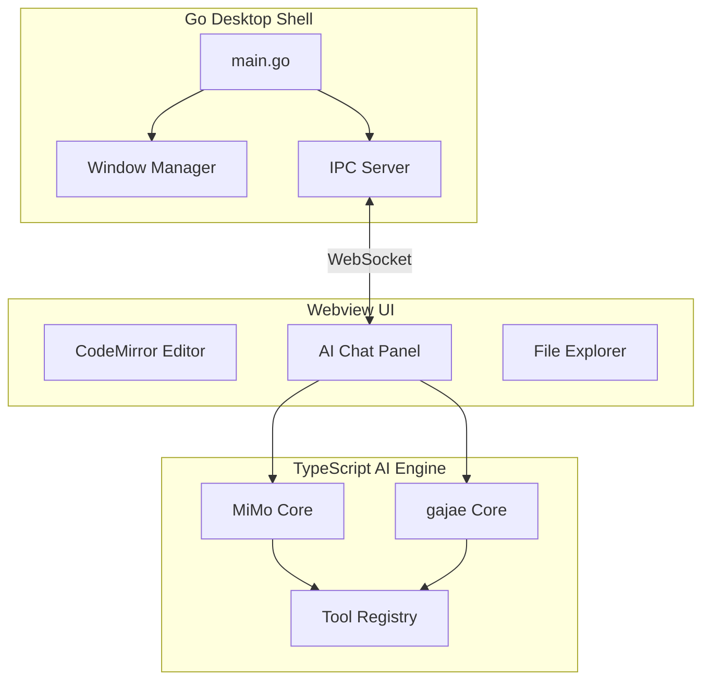

# Orbit Code

AI 기반 코드 에디터 - Go 데스크탑 + TypeScript AI 엔진

## 🚀 특징

- **CodeMirror 6 에디터** - 고성능 코드 편집
- **AI 어시스턴트** - MiMo-Code + gajae-code 통합
- **파일 탐색기** - 프로젝트 구조 탐색
- **터미널 통합** - 내장 터미널
- **Upstream 동기화** - MiMo-Code 자동 동기화

## 📁 프로젝트 구조

```
orbit_code/
├── cmd/orbit/           # Go 메인 애플리케이션
├── internal/            # Go 내부 패키지
│   ├── desktop/         # 데스크탑 윈도우 관리
│   ├── editor/          # 에디터 코어
│   └── ipc/             # IPC 통신
├── packages/
│   ├── ai-engine/       # TypeScript AI 엔진
│   └── webview-ui/      # 에디터 UI (CodeMirror)
├── scripts/             # 유틸리티 스크립트
├── go.mod               # Go 모듈
└── package.json         # Node.js 패키지
```

## 🛠️ 설치 및 실행

### 사전 요구사항

- Go 1.21+
- Node.js 18+
- Bun 1.0+

### 설치

```bash
# 저장소 클론
git clone https://github.com/Edward-Lucas/Orbit-Code.git
cd Orbit-Code

# 의존성 설치
bun install

# Go 의존성
go mod tidy
```

### 실행

```bash
# 개발 서버 실행
bun run dev

# 또는 Go 앱 실행
go run ./cmd/orbit .
```

## 🔄 Upstream 동기화

MiMo-Code에서 변경사항을 동기화하려면:

```bash
# 동기화 스크립트 실행
./scripts/sync-upstream.sh

# 변경사항 확인
git status

# 커밋
git add .
git commit -m "chore: sync with MiMo-Code"
```

## 🏗️ 아키텍처



## 📝 라이선스

MIT License

## 🤝 기여

기여는 환영합니다! Issue를 생성하거나 Pull Request를 보내주세요.
